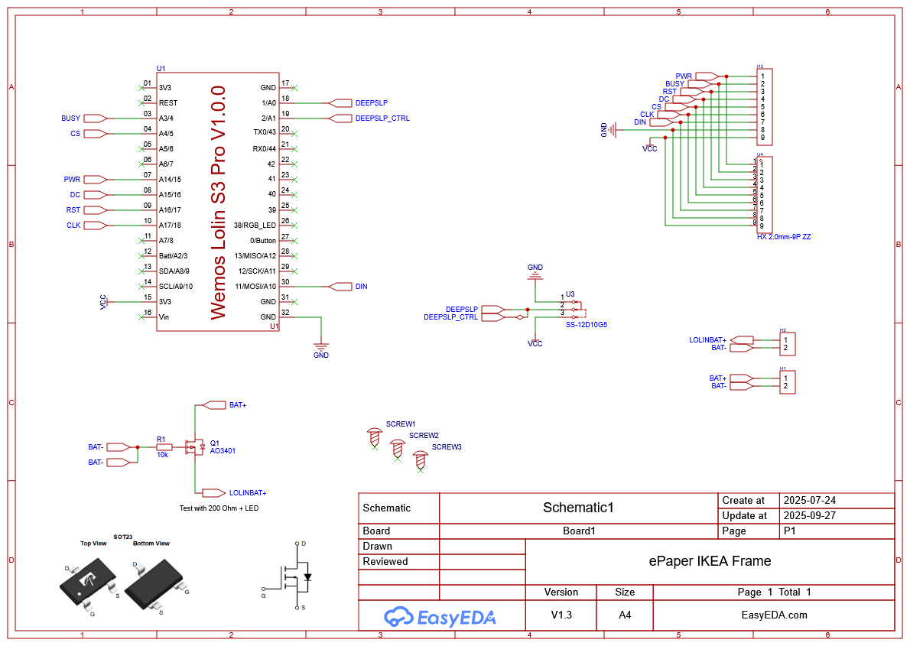
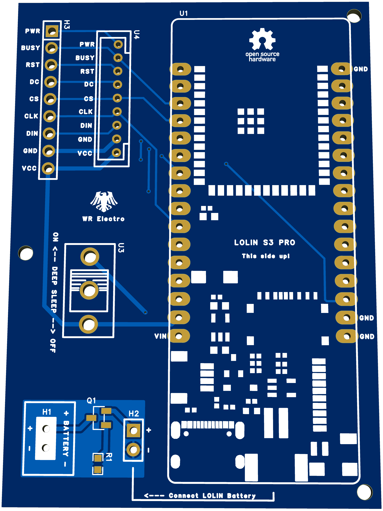

# ESPHome e-Paper Dashboard

A battery-powered e-ink dashboard for [Home Assistant](https://www.home-assistant.io/), built with [ESPHome](https://esphome.io/) on a **LOLIN S3 Pro** (ESP32-S3) and a **Waveshare 7.5" e-Paper** display. It wakes up every 20 minutes, pulls data from Home Assistant, renders the screen, and goes back to deep sleep — lasting about **a month+ on a 2500 mAh battery**.

Inspired by [Madelena's Weatherman Dashboard](https://github.com/Madelena/esphome-weatherman-dashboard).

> **Note:** The on-screen UI language is Polish. All code comments are in English.

---

## Features

The dashboard is built around a few fixed layout zones — you keep what's useful and remove what isn't. All data sources are optional except weather.

- **Current weather** — large temperature + MDI condition icon, indoor temperature & humidity
- **4-day forecast** — per-day condition icons and max temperatures
- **Sensor data** — any HA sensors: temperature, humidity, pressure, air quality, UV index, or anything else numeric
- **Calendar** — events from one or more HA calendars, with optional keyword-based logic (work shifts, vacations, custom labels)
- **Any numeric HA data** — exchange rates, fuel prices, EV status, task counters, or any sensor you have
- **Deep sleep** — configurable wake/sleep cycle; ~1 month on 2500 mAh LiPo with default settings (90 s / 20 min)
- **Battery & WiFi status** in the footer, with alert below 15%
- **Custom PCB available** (optional) — Gerber files included in `assets/`

---

## How It Works

```
┌─────────────┐     WiFi       ┌─────────────────┐
│  ESP32-S3   │──────────────▶│  Home Assistant │
│  (LOLIN S3) │◀──────────────│  (API)          │
└──────┬──────┘   sensors +    └─────────────────┘
       │          calendar +
       │          weather data
       ▼
┌─────────────┐
│  Waveshare  │
│  7.5" e-ink │
└─────────────┘
```

**Boot cycle:**

1. ESP32 wakes from deep sleep
2. Powers on the e-paper display (GPIO15)
3. Connects to WiFi and Home Assistant API (timeout: 20 s)
4. Waits for sensor data — weather, calendar, battery (timeout: 30 s)
5. Renders the full display layout in one pass
6. Waits 5 s for the e-ink to finish physical rendering
7. Enters deep sleep for 20 minutes
8. Repeat

---

## Display Layout

The display is 800×480 px, rotated 90° (portrait orientation: 480 wide × 800 tall).
It is divided into five horizontal zones stacked top to bottom:

**Zone 1 — Current weather** *(top, ~225 px)*  
Large condition icon (MDI, 96 pt) on the left, current outdoor temperature (108 pt bold) in the centre, indoor temperature and humidity on the right.

**Zone 2 — 4-day forecast** *(~95 px)*  
Four columns, each showing a weekday abbreviation, a weather icon (36 pt MDI), and the forecast maximum temperature.

**Zone 3 — Left column: date & events** *(remaining height, left 57%)*  
Current date (day name + numeric date), then configurable data rows (exchange rate, task count, precipitation, or anything numeric), followed by a calendar section with today's and tomorrow's events.

**Zone 4 — Right column: sensor data** *(remaining height, right 43%)*  
Sensor readings with MDI icons (temperature, humidity, pressure, UV index, air quality, fuel price), then a secondary section for any additional data you want — EV status, energy usage, custom sensors, etc.

**Zone 5 — Footer** *(bottom ~20 px)*  
WiFi signal strength icon + dBm value, battery icon + percent, last update timestamp — fixed to the bottom edge.

---

## Hardware

### Required

| Component | Notes |
|-----------|-------|
| **LOLIN S3 Pro** (ESP32-S3) | Development board — see [Why LOLIN S3 Pro?](#why-lolin-s3-pro) below |
| **Waveshare 7.5" e-Paper V2** | 800×480 px, monochrome (black/white), SPI interface |
| **LiPo battery** (3.7 V) or **USB-C cable** | 2500 mAh recommended for ~1 month battery life |

### Optional

| Component | Notes |
|-----------|-------|
| **Custom PCB** | Simplifies wiring, adds basic reverse polarity protection via AO3401 MOSFET — [Gerber files](assets/Gerber_PCB_epaper_dashboard.zip) included. **Without the PCB there is no reverse polarity protection** — see [Electrical & Hardware Safety](SECURITY.md#electrical--hardware-safety) |
| **IKEA RÖDALM frame** (13×18 cm) | For a clean wall-mounted look |
| **Outdoor/indoor sensors** (e.g. BME280 + PMS5003) | For environmental data — any HA-compatible sensor works |

### Why LOLIN S3 Pro?

The LOLIN S3 Pro was chosen specifically for battery-powered e-ink projects:

- **Built-in LiPo battery management** — charging circuit with JST connector, no external TP4056 module needed
- **Battery voltage via ADC** (GPIO3) — the board has a built-in voltage divider; just read the pin and multiply by 2
- **Excellent deep sleep performance** — ESP32-S3 draws very low current in deep sleep
- **~1 month on 2500 mAh** — with current settings (20 min sleep / 90 s wake cycle), real-world battery life is approximately one month
- **USB-C** — modern connector for both charging and programming
- **Compact form factor** — fits well inside picture frames

### Wiring (without Custom PCB)

Connect the Waveshare e-Paper to the LOLIN S3 Pro:

| ESP32 GPIO | e-Paper Pin | Function |
|------------|-------------|----------|
| GPIO18 | CLK | SPI Clock |
| GPIO11 | DIN | SPI MOSI (data) |
| GPIO5 | CS | Chip Select |
| GPIO16 | DC | Data/Command |
| GPIO4 | BUSY | Busy signal (active LOW — inverted in config) |
| GPIO17 | RST | Reset (10 ms pulse) |
| GPIO15 | — | Display power control (turn on/off via MOSFET or direct) |

**Optional pins:**

| ESP32 GPIO | Function |
|------------|----------|
| GPIO3 | Battery ADC — reads voltage through built-in divider (×2) |
| GPIO2 | Deep sleep ON/OFF slide switch (INPUT_PULLDOWN, inverted) |
| GPIO1 | Wakeup pin (keeps awake when active) |

### Schematic & Custom PCB

The project includes a custom PCB designed in EasyEDA (credit: WR Electro). It integrates:

- **AO3401 P-MOSFET** (Q1) — routes battery power to the LOLIN board; its body diode provides basic reverse polarity protection (see [Electrical & Hardware Safety](SECURITY.md#electrical--hardware-safety))
- **SS-12D10G5 slide switch** (U3) — hardware deep sleep enable/disable
- **10 kΩ resistor** (R1) — MOSFET gate pull control
- **Screw terminals** (H1) — external battery connection
- **HX 2.0mm 9P connectors** (H3, U4) — e-Paper ribbon cable breakout
- **JST battery connector** (H2) — connects to LOLIN's built-in charger

<p align="center">
  
</p>

<p align="center">
  
</p>

Gerber files for PCB manufacturing: [`assets/Gerber_PCB_epaper_dashboard.zip`](assets/Gerber_PCB_epaper_dashboard.zip)

> You can order the PCB from JLCPCB, PCBWay, or any other manufacturer. Upload the Gerber ZIP and use default settings (2 layers, 1.6 mm thickness).

---

## Software Requirements

| Requirement | Details |
|-------------|---------|
| **Home Assistant** | Any installation method (HAOS, Docker, Core, Supervised) |
| **ESPHome** | As HA add-on or standalone CLI |
| **Weather integration** | e.g. [Met.no](https://www.home-assistant.io/integrations/met/) — entity: `weather.forecast_dom` |
| **Calendar integration(s)** | Optional — up to 3 calendars for events/shifts/holidays |

### Optional Integrations

These are used in the default config but can be removed or replaced:

| Integration | Entity | Purpose |
|-------------|--------|---------|
| Outdoor sensor | `sensor.taras_*` | Temperature, humidity, pressure, PM2.5 |
| Indoor sensor | `sensor.esphome_web_d57124_*` | Living room temp & humidity |
| Hyundai/Kia Connect | `sensor.tucson_*` | EV battery, electric range, fuel range |
| Tankerkoenig | `sensor.industriestr_34_super` | Local fuel price (€) |
| Currency exchange | `sensor.eur_pln` | EUR → PLN rate |
| Donetick | `sensor.donetick_open_tasks` | Open household tasks |

---

## Quick Start

> For users already familiar with Home Assistant and ESPHome.

1. **Clone** this repository:
   ```bash
   git clone https://github.com/pavlojs/esphome-epaper-dashboard.git
   ```

2. **Copy fonts** to your ESPHome config directory:
   ```bash
   cp -r fonts/ /config/esphome/fonts/
   # or ~/.config/esphome/fonts/ for CLI users
   ```

3. **Create `secrets.yaml`** (if not already present) in your ESPHome config directory:
   ```yaml
   wifi_ssid: "YourWiFiSSID"
   wifi_password: "YourWiFiPassword"
   ```

4. **Edit `dashboard.yaml`** — replace entity IDs with your own (see [Customization](#customization))

5. **Flash** the LOLIN S3 Pro:
   - Via ESPHome Dashboard: upload `dashboard.yaml`, click Install
   - Via CLI: `esphome run dashboard.yaml`

6. **Add template sensors** — copy the contents of `templates.yaml` into your Home Assistant `configuration.yaml` under the `template:` key:
   ```yaml
   template:
     - trigger:
         # ... (paste contents of templates.yaml here)
   ```

7. **Restart Home Assistant** to activate the template sensors

---

## Beginner Guide

New to Home Assistant or ESPHome? Here's a step-by-step walkthrough.

### What is ESPHome?

[ESPHome](https://esphome.io/) is a tool that lets you configure ESP32/ESP8266 microcontrollers using simple YAML files. It integrates natively with Home Assistant — no custom firmware coding required.

### Step 1: Install the ESPHome Add-on

1. In Home Assistant, go to **Settings → Add-ons → Add-on Store**
2. Search for **ESPHome** and install it
3. Start the add-on and open the Web UI

### Step 2: Set Up Your Weather Integration

1. Go to **Settings → Devices & Services → Add Integration**
2. Search for **Meteorologisk institutt (Met.no)** (or your preferred weather provider)
3. Configure it with your home coordinates
4. Note the entity name (e.g., `weather.forecast_dom`)

### Step 3: Find Your Entity IDs

Entity IDs are how Home Assistant identifies each sensor, switch, or device.

1. Go to **Developer Tools → States** (in your HA sidebar)
2. Use the search/filter to find sensors you want to display
3. The entity ID looks like `sensor.living_room_temperature`
4. Replace the entity IDs in `dashboard.yaml` with your own

### Step 4: Prepare the Hardware

1. Connect the Waveshare e-Paper to the LOLIN S3 Pro using the [pin mapping table](#wiring-without-custom-pcb)
2. Connect via USB-C to your computer
3. If using a battery, connect it to the LOLIN's JST battery connector

### Step 5: Flash the Firmware

1. In the ESPHome Dashboard, click **+ New Device**
2. Instead of creating from scratch, upload the `dashboard.yaml` file
3. Make sure `fonts/` is in the correct directory
4. Click **Install → Plug into this computer** (for first flash via USB)
5. Subsequent updates can be done wirelessly (OTA)

### Step 6: Add Template Sensors to HA

The `templates.yaml` file creates sensors that process weather forecast data into a format the dashboard can display.

1. Open your Home Assistant `configuration.yaml`
2. Add a `template:` section (if it doesn't exist)
3. Paste the contents of `templates.yaml` under it
4. Go to **Developer Tools → YAML → Template Entities → Reload**

---

## Customization

### Entity ID Reference

Every sensor in `dashboard.yaml` can be replaced with your own. Here's the full list:

| Variable in YAML | Default Entity ID | Purpose | Required? |
|---|---|---|---|
| `ha_weather_temperature` | `weather.forecast_dom` (attribute: temperature) | Current temperature | **Yes** |
| `ha_weather_condition` | `weather.forecast_dom` | Weather condition (cloudy, sunny, etc.) | **Yes** |
| `ha_weather_uv` | `weather.forecast_dom` (attribute: uv_index) | UV index | No |
| `ha_today_rain` | `sensor.forecast_today_precipitation` | Today's precipitation (mm) | No |
| `ha_forecast_1-4_*` | `sensor.forecast_day_*` | 4-day forecast (from `templates.yaml`) | No |
| `local_temp` | `sensor.taras_temperature` | Outdoor temperature | No |
| `local_humidity` | `sensor.taras_humidity` | Outdoor humidity | No |
| `local_pressure` | `sensor.taras_pressure` | Atmospheric pressure | No |
| `local_air` | `sensor.taras_pm2_5` | PM2.5 air quality | No |
| `livingroom_temp` | `sensor.esphome_web_d57124_living_room_temperature` | Indoor temperature | No |
| `livingroom_humidity` | `sensor.esphome_web_d57124_living_room_humidity` | Indoor humidity | No |
| `home_tasks` | `sensor.donetick_open_tasks` | Open tasks count | No |
| `local_fuel` | `sensor.industriestr_34_super` | Local fuel price (€) | No |
| `eur_pln` | `sensor.eur_pln` | EUR → PLN exchange rate | No |
| `ev_battery` | `sensor.tucson_ev_battery_level` | EV battery (%) | No |
| `ev_range` | `sensor.tucson_ev_range` | EV electric range (km) | No |
| `fuel_range` | `sensor.tucson_fuel_driving_range` | Fuel range (km) | No |
| Calendar | `calendar.smarthome`, `calendar.urlopy`, `calendar.swieta_w_niemczech` | 3 calendar sources | No |

### How to Replace an Entity

Each sensor in `dashboard.yaml` has a block like this:

```yaml
  - platform: homeassistant
    id: local_temp                          # internal ID — used in the display lambda
    entity_id: sensor.taras_temperature     # ← replace this with YOUR entity ID
    internal: true
    unit_of_measurement: "°C"
```

To change it, **only replace `entity_id`** — keep the `id` the same, as it's referenced by the display rendering code.

**How to find your entity ID in Home Assistant:**

1. Go to **Developer Tools → States**
2. Filter by type (e.g., type "temperature")
3. Copy the `entity_id` value (e.g., `sensor.garden_temperature`)
4. Paste it into `dashboard.yaml` in the corresponding block

### How to Add a New Sensor

To display a new piece of data, you need to do three things:

**1. Add the sensor block** in the `sensor:` section of `dashboard.yaml`:

```yaml
  - platform: homeassistant
    id: my_new_sensor              # pick a unique ID
    entity_id: sensor.your_entity  # your HA entity
    internal: true
    unit_of_measurement: "°C"      # optional — match your sensor's unit
```

**2. Add rendering code** in the display `lambda:` section. Find a spot where you want it and add:

```cpp
      // My new sensor
      if (!std::isnan(id(my_new_sensor).state))
        it.printf(x, y, id(font_small_bold), TextAlign::TOP_LEFT, "%.1f°C", id(my_new_sensor).state);
      else
        it.printf(x, y, id(font_small_bold), TextAlign::TOP_LEFT, "b/d");
```

Replace `x, y` with pixel coordinates (the display is 480 wide × 800 tall after rotation).

**3. For text sensors** (non-numeric), use `text_sensor:` instead of `sensor:`:

```yaml
text_sensor:
  - platform: homeassistant
    id: my_text_sensor
    entity_id: sensor.your_text_entity
    internal: true
```

And in the lambda:
```cpp
      it.printf(x, y, id(font_small), TextAlign::TOP_LEFT, "%s", id(my_text_sensor).state.c_str());
```

### How to Remove a Section

To remove something you don't need (e.g., Tucson PHEV, fuel price, tasks), **delete two things**:

**1. The sensor definition** — find and delete the whole `- platform: homeassistant` block:

```yaml
  # Delete this entire block:
  - platform: homeassistant
    id: ev_battery
    entity_id: sensor.tucson_ev_battery_level
    internal: true
    unit_of_measurement: "%"
```

**2. The rendering code** — find the corresponding section in the display `lambda:` and delete it. Look for the `id(ev_battery)` reference. For the Tucson section, delete from the separator line (`it.line(right_col_x, ...)`) through the `fuel_range` printf.

> **Tip:** Use your editor's search to find all references to the sensor's `id` (e.g., search for `ev_battery`) to make sure you delete everything.

### How to Customize Calendars

Calendars are configured in **two places**:

**1. `templates.yaml`** — defines which HA calendars to fetch events from:

```yaml
  entity_id:
    - calendar.smarthome            # Replace with your calendar
    - calendar.urlopy               # Replace or remove
    - calendar.swieta_w_niemczech   # Replace or remove
```

To **add a calendar**, add another `- calendar.your_calendar` line and add a matching variable:
```yaml
  - variables:
      events_smarthome: "{{ agenda['calendar.smarthome']['events'] | default([]) }}"
      events_urlopy: "{{ agenda['calendar.urlopy']['events'] | default([]) }}"
      events_swieta: "{{ agenda['calendar.swieta_w_niemczech']['events'] | default([]) }}"
      events_new: "{{ agenda['calendar.your_calendar']['events'] | default([]) }}"  # ← add
      events_all: "{{ events_smarthome + events_urlopy + events_swieta + events_new }}"  # ← include
```

To **remove a calendar**, delete its `entity_id` line, its variable, and remove it from `events_all`.

**2. `dashboard.yaml`** — the calendar rendering code in the display lambda has special logic for:

- **Work shifts** — events containing "früh"/"spät"/"nacht" are mapped to Polish shift names
- **Vacations** — events containing "urlop"/"urlaub" suppress shift display and show "Urlop" instead
- **Trash collection** — events containing "wywóz"/"śmieci" get a trash icon

To change these keywords, search for them in the `analyze_day` lambda function and modify to match your calendar event names.

### Adjusting Timings

In `dashboard.yaml`, you can modify:

```yaml
deep_sleep:
  run_duration: 90s       # How long the ESP stays awake
  sleep_duration: 20min   # How long between wake-ups
```

Shorter `sleep_duration` = more frequent updates but shorter battery life.

---

## Home Assistant Template Sensors

The [`templates.yaml`](templates.yaml) file provides template sensors that:

1. **Forecast sensors** — extract daily forecast data (temperature, conditions, date) from your weather integration. The dashboard reads these via the ESPHome HA API.

2. **Calendar aggregator** — merges events from 3 calendars into a single `sensor.upcoming_events` entity with a structured `events` attribute. It fetches 2 days of events to reliably cover both today and tomorrow.

### Calendar Setup

Replace these calendar entity IDs in `templates.yaml` with your own:

```yaml
entity_id:
  - calendar.smarthome            # Your main calendar
  - calendar.urlopy               # Vacation calendar
  - calendar.swieta_w_niemczech   # Holidays calendar
```

### Weather Integration

Replace the weather entity in `templates.yaml`:

```yaml
entity_id: weather.forecast_dom   # ← replace with your weather entity
```

And update the forecast references (`forecast['weather.forecast_dom']`) to match:

```yaml
state: "{{ forecast['weather.your_entity'].forecast[0].temperature }}"
```

---

## Power Management

| Parameter | Value |
|-----------|-------|
| Wake duration | 90 seconds |
| Sleep duration | 20 minutes |
| Wakeup pin | GPIO1 (keeps awake when active) |
| Display power | GPIO15 (turned off before sleep) |
| Battery ADC | GPIO3 (×2 multiplier, 12 dB attenuation) |
| Battery range | 3.0 V (0%) — 4.2 V (100%) |
| Deep sleep switch | GPIO2 (slide switch, optional) |

The display power is managed via GPIO15 — it is turned **on** at boot and turned **off** on shutdown to minimize current draw during sleep.

### Deep Sleep Switch (GPIO2)

The SS-12D10G5 slide switch connected to GPIO2 controls whether the device is allowed to enter deep sleep:

| Switch position | Effect |
|-----------------|--------|
| **ON** | Normal operation — device enters deep sleep for 20 minutes after each update |
| **OFF** | `KEEP_AWAKE` — deep sleep is disabled; device stays awake indefinitely |

The OFF position is useful during **development, serial monitoring, or OTA firmware updates** — when the device is in deep sleep most of the time, OTA is only possible within the 90 s wake window. Flipping the switch to OFF keeps it reachable permanently. Flip back to ON for normal battery-powered operation.

---

## Troubleshooting

| Problem | Solution |
|---------|----------|
| **Blank display after boot** | Check SPI wiring. Verify `busy_pin` is inverted. Check GPIO15 power output. |
| **"AKTUALIZACJA DANYCH..." stays on screen** | The device couldn't get data from HA within 30 s. Check WiFi credentials in `secrets.yaml`. Verify HA is reachable and the API is enabled. Check ESPHome logs for connection errors. |
| **Some data shows "b/d" (no data)** | The corresponding HA sensor entity doesn't exist or has no state. Check entity IDs. |
| **Battery drains fast** | Reduce `run_duration`. Check that the display power is off during sleep. Verify deep sleep is actually entering (check logs). |
| **Compilation error about missing fonts** | Make sure the `fonts/` directory is in your ESPHome config folder alongside `dashboard.yaml`. |
| **OTA update fails** | The device is in deep sleep most of the time. Use the wakeup pin or catch it during the 90 s wake window. Flash via USB if needed. |

---

## Credits

- Inspired by [Weatherman Dashboard](https://github.com/Madelena/esphome-weatherman-dashboard) by [@Madelena](https://github.com/Madelena)
- Fonts: [Google Noto Sans](https://fonts.google.com/noto/specimen/Noto+Sans), [Material Design Icons](https://materialdesignicons.com/)
- PCB design: WR Electro (EasyEDA, schematic V1.3)

## License

This project is licensed under the [MIT License](LICENSE).